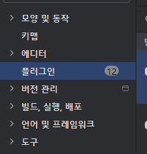
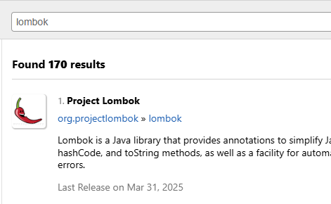
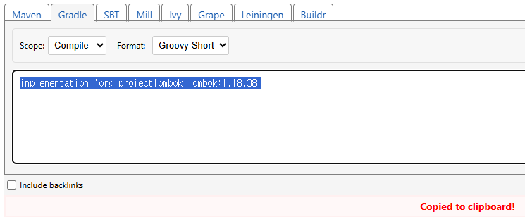
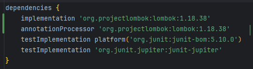

# Object 클래스
- 모든 클래스는 Object 클래스를 상속 받는다. 그래서 interface를 implement 할 때나 다른 sub 클래스 만들어서 extends 명령어 입력했을 때 우리가 직접 만들었던 슈퍼 클래스 이외에 toString() 어쩌고 한 것들이 있었습니다.
  1. toString() : 기본적으로 모든 클래스는 Object 클래스를 상속 받아서,클래스 이름과 해시코드(일종의 주소지 개념)를 return 함.
     - 이를 Override해서 재정의하여 클래스의 정보를 출력할 때 사용함.
     - 필드를 정의하고, toString() 메서드를 override해서 필요한 필드를 출력함 -> Main 단계에서 특정 객체의 특정 필드를 객체의 이름만으로 출력이 가능함.(sout(객체명); 으로 가능 / sout(객체명.showInfo())가 아니라.)

  2. equals() : 두 객체가 '논리적으로 같은지'를 비교하는 메서드(주소지의 차이가 아니라). 기본적으로 Object 클래스의 equals() 메서드는 두 객체의 참조 주소를 비교합니다.
     - 형식 : 객체명1.equals(객체명2) -> 객체명1과 객체명2의 참조 주소가 동일한지 확인함.
  3. hashCode() : 객체를 정수 값(해시값)으로 변환(16진수가 아니라). 해시 값은 주로 해시 기반 컬렉션에서 사용됩니다.
     - equals() 메서드를 재정의하게 되면 반드시 hashCode() 메서드도 재정의해야만 합니다. 왜냐면 동일한 객체(equals == true)는 동일한 해시 코드를 가져야하기 때문인데, 문제는 해시코드가 같다고 해서 또 equals()가 true가 아닌 경우가 있습니다.

# Lombok


플러그인 선택

롬복 검색후 설치

chrome -> maven repositories 로 들어가서 lombok 검색
빌드 시스템이 gradle 이기 때문에 groovy short 로 복사


그 이후 build.gradle 파일 변경

방금 복사한 implementation 추가 후
annotationProcessor 도 추가

# Lombok 주요 annotation
1. @Getter / @Setter
   - class level에 작성할 경우 getter / setter 메서드를 자동 생성.
   - field level에 작성할 경우 해당 필드에만 메서드 생성
   - 주의 : 객체마다 다른 값을 갖게 되는 비정형(non-static) 필드에 대해서만 적용됨.
```java
@Setter
@Getter
public class Person{
    private String name;
    private int age;
}
```

2. @ToString
   - toString() 메서드를 자동으로 생성. 근데 문제는 재정의가 안되고 Lombok 라이브러리 default 형태만 튀어나오기 때문에 결과적으로 원하는 부분만 보여주기 위해서는 override methods를 쓰는 경우가 많을 겁니다.
3. @EqualsAndHashCode
   - equals() / hashCode() 메서드를 자동 생성. 객체의 동일성 비교 로직을 구현할 때 사용
     - equals()를 재정의하면 hashCode()도 반드시 같이 재정의해야하기 때문에 애너테이션도 세트로 묶여있습니다.
4. @NoArgsConstructor / @RequiredArgsConstructor / @AllArgsConstructor
   - @NoArgsConstructor : argument가 없는 기본 생성자를 생성
   - @RequiredArgsConstructor : final 또는 '@NonNull' 애너테이션이 붙은 필드만 필수적으로 요구하는 매개변수 생성자를 생성
   - @AllArgsConstructor : 모든 필드를 argument로 요구하는 매개변수 생성자
```java
@NoArgsConstructor
@RequiredArgsConstructor
@AllArgsConstructor
public class Person {
    @NonNull
    private String name;
    private int age;
}

public class PersonMain {
    public static void main(String[] args) {
        Person person1 = new Person();  // 기본 생성자
        Person person2 = new Person("김이");  // name을 요구하는 매개변수 생성자
        Person person3 = new Person("김삼", 20);  // AllArgsconstructor
    }
}
```

4. @Data
   - @Getter / @Setter / @ToString / @EqualsAndHashCode / @RequiredArgsConstructor가 다 들어가있는 종합 패키지 애너테이션입니다.

```java
@Entity
@Data
@NoArgsConstructor  //jva 만들대 기본생성자가 필수적으로 요구됨
@AllArgsConstructor
public class Student extends Person{
    private String name;
    private int age;
    private double score;
}
```

5. @Builder

